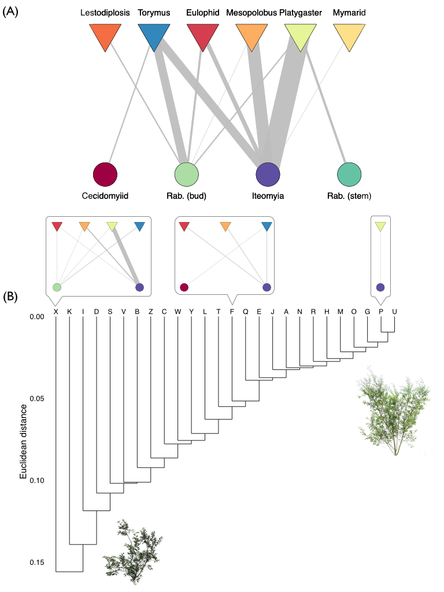
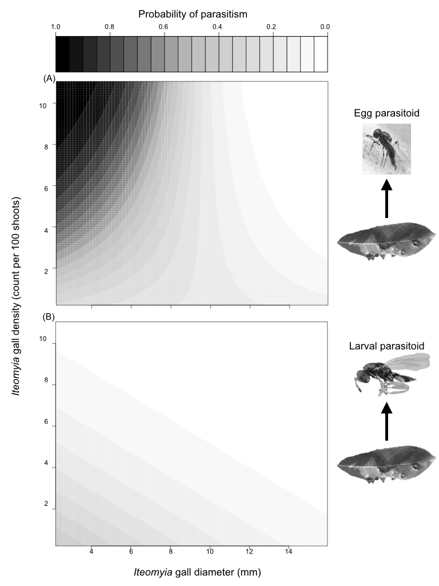

### Abstract
The structure of species interaction networks is an emergent property of interactions between individual organisms. While we know this network structure can have a profound influence on community dynamics, we still have a limited understanding of how different genotypes and phenotypes of individual organisms contribute to overall network structure. We address this knowledge gap by using a common garden experiment to examine how genetic and phenotypic variation within a dominant plant species influences an insect herbivore-parasitoid interaction network. We found that plant genetic variation was an important driver of dissimilarity in the herbivore-parasitoid network. Specifically, we found that herbivore suscpetibility to attack from particular parasitoid species and guilds depended on willow genotype. This variation in herbivore susceptibility was determined by both the density and size of herbivores, which in turn was affected by leaf quality and plant architecture traits. Taken together, our results indicate that genetic variation can play a key role in structuring ecological networks. Furthermore, our results highlight the potential for microevolutionary processes to shape both the structure and dynamics of ecological networks.

### Introduction  
Ecological networks provide a map of who interacts with whom in diverse communities. By accurately quantifying their structure, we can begin to understand the processes that organize these networks (CITE) as well as how network structure affects the persistence of ecological communities (CITE). Typically though, studies quantifying the structure of ecological networks have been resolved to the species level (Ings et al., 2009). These species-level networks implicitly assume that each species consists of a homogenous population of individuals, all of which interact with individuals of different species in the same way. Yet, virtually all populations are heterogenous mixtures of individuals and this phenotypic variation can have large effects on the structure and dynamics of ecological networks (CITE INDIVIDUAL STUDIES AND TREE REVIEWS). Consequently, if we continue to ignore how individual differences scale up to affect species interactions, we risk overlooking fundamental drivers of how ecological networks are organized (CITE INDIVIDUAL STUDIES HERE).

Genetic variation is a key driver of individual differences and there are a growing number of examples demonstrating its cascading effects on multitrophic interactions (Antonovics 1992; Whitham et al. 2003, 2012). For example, genetic variation within plant species can influence the density and size of herbivores, which in turn alters interactions with higher trophic levels (Bailey et al., 2006; Johnson 2008; Abdala-Roberts and Mooney 2014). Similarly, genetic and phenotypic variation within predators has been found to mediate the strength of trophic cascades (Post et al. 2008; Harmon et al., 2009; Bassar et al., 2010). While it is clear that microevolutionary processes within a single species can influence pairwise species interactions and community composition at different trophic levels, these studies have neglected to quantify changes in the organization of the ecological network. 

Understanding how genetic and phenotypic variation influences the organization of ecological networks is important, as this enhances our ability to predict the eco-evolutionary dynamics of multitrophic communities (CITE JORDI and Carlos Melian). For example, if trait variation in a plant species influences their susceptibility to different herbivore species, and this trait variation is heritable, then we have a mechanism by which genetic variation drives dissimilarity in the herbivore community (Agrawal 2005; Barbour et al. 2015). Morever, if the genetic and phenotypic variation in the plant is large enough, then the resulting dissimilarity in the herbivore community may influence the functional and numerical response of upper trophic levels, providing a mechanism for how genetic variation could drive dissimilarity in an ecological network. From here, we can begin to predict how trait evolution will affect the eco-evolutionary dynamics of networks (Guimeras et al., 20011; Nuismer et al., 2012). Despite this promising avenue for future research, we are currently lacking empirical tests of whether genetic variation drives dissimilarity in the structure of ecological networks (but see Bukovinsky et al. 2008).

Here, we test the hypothesis that genetic and phenotypic variation drives dissimilarity in ecological networks using a subset of the insect food web associated with the coastal willow *Salix hookeriana*. Specifically, this insect food web consisted of four species of gall midges (Family: Cecidomyiidae) and the six species of natural enemies that attack them (Fig. 1A). This plant-insect food web was ideal for testing our hypothesis for two reasons. Firstly, *S. hookeriana* displays considerable genetic and phenotypic variation that results in variation in the density of galling insects (Barbour et al. 2015 in press). *A priori*, we expect that variation in gall density would affect both the functional and numerical response of their natural enemies, thereby providing a mechanistic link for how plant genetic variation could affect this food web. Second, the closed nature of their galls restricts their parasitoid community to a small number of species that can successfully locate and parasitize galls. Consequently, it is easy to identify and quantify the sources of mortality, making this food web amenable to building quantitative interaction networks (van Veen et al. 2006). 

If genetic and phenotypic variation within species drives dissimilarity in ecological networks, we would predict the following three things. Firstly, we predict that the structure of insect food webs will vary among willow genotypes. Secondly, we predict that variation in the insect food web will be explained by the functional and numerical responses of the natural enemies to genetic variation in gall density and gall size. Finally, we predict that variation in gall density and gall size will result from genetic variation in leaf quality and plant architectural traits. Taken together, our study seeks to understand how genetic variation shapes the structure of ecological networks. And since genetic variation provides the raw material for evolution, establishing a genetic basis to the organization of ecological networks will begin to inform the eco-evolutionary dynamics of multitrophic communities. 


### Methods

## Common Garden
To isolate the effects of genetic variation within Salix hookeriana (hereafter ‘willow’) on the insect food web, we used a common garden experiment consisting of 26 different genotypes of S. hookeriana (13 males; 13 females), located at Humboldt Bay National Wildlife Refuge (HBNWR) (40°40'53"N, 124°12'4"W) near Loleta, California, USA. Willow genotypes were collected from a single population of willows growing around Humboldt Bay. This common garden was planted in February 2009 with 25 clonal replicates (i.e., stem cuttings) of each willow genotype in a completely randomized design in two hectares of a former cattle pasture at HBNWR. Willows in our garden begin flowering in February and reach their peak growth in early August. During this study, willows had reached 2-4 m in height. Further details on the genotyping and planting of the common garden are available in Barbour et al. (2015, in press).

## Dissimilarity of insect food web
To build quantitative insect food webs, we collected galls from about 5 randomly chosen replicates of each genotype in September 2012 (N = 146 trees, range = 4-9 trees per genotype). For each replicate willow, we collected all galls occurring on one randomly selected basal branch. For each branch, we estimated the number of shoots based on an allometric equation using the stem diameter of the sampled basal branch (mean ± SD shoot count = 280 ± 124; details in supplementary materials). We then used these shoot estimates to quantify the density of gall-parasitoid interactions on each replicate willow. To quantify gall-parasitoid interactions, we placed collected galls into 30 mL plastic transport vials (loosely capped at the end), which we maintained at room temperature in the lab for four months. We then opened galls under a dissecting scope and determined whether the gall survived or was parasitized, and if parasitized, the identity of the parasitoid species. We omitted from analyses those galls for which we could not reliably determine the cause of mortality.

**FRAMEWORK FOR MEASURING NETWORK BETA-DIVERSITY** We measured the dissimilarity of insect food webs among willows by analyzing both qualitative and quantitaive differences in the composition of their links (i.e., species interactions) (Poisot et al. 2012). These differences in link composition can then be further partitioned into species turnover and interaction components. Specifically, differences due to species turnover arise from the gain/loss of species (either gall or parasitoid) altering link composition, whereas differences due to interactions occur when species switch with whom they are interacting, despite having the same species composition. To measure qualitative differences, we transformed the quantitative network into presence/absence data and calculated the pairwise Euclidean distances between sites. We used Euclidean distance because we considered the joint absence of the same interaction between sites as meaningful. We note though that we obtain the same qualitative results when we use other common dissimilarity indices for presence/absence (e.g. Jaccard, Sorenson, Whittaker; details in supplementary info). 
Given that the dissimilarity in network structure between two sites will be positively correlated with differences in species richness between sites, we used a probabilistic null model to tease apart the contribution of differences in species richnes the Raup-Crick null model ('raupcrick' function in *vegan* package in R).*tighten up the language here*

To measure quantitative differences, we used Euclidean distance. As the with presence/absence data, other common dissimilarity indices gave qualitatively the same results (e.g. Bray-Curtis, Horn-Morisita; details in supplementary info). To get a better understanding of the processes driving the quantitative dissimilarity among genotypes, Since we were also interested in understanding which 
FOR QUANTITATIVE DIFFERENCES, WE ALSO USED EUCLIDEAN DISTANCE. AS WITH THE QUALITATIVE DATA, OTHER DISSIMILARITY INDICES GAVE QUALITATIVELY THE SAME RESULTS, WHICH WE REPORT IN THE SUPPLEMENTARY INFO. 

**ANALYZING NETWORK BETA-DIVERSITY** To test whether willow genetic variation drove beta-diversity of gall-parasitoid networks, we used permutational ANOVA (PERMANOVA, 'adonis' function with *vegan* package in R) on pairwise Euclidean distances between link composition, with willow genotype modelled as a random effect. We then partitioned the relative contribution of species turnover and interaction components (with betalink package in R) to understand the processes driving network beta-diversity among genotypes. To estimate the proportion of variance in network dissimilarity explained by willow genotype, we calculated broad-sense heritability (*H^2*) using the equation: H2 = VG / VP, where VG is the total genotypic variance among clones, and VP is the total phenotypic variance, calculated as the sum of the residual (Vr) and genetic variance (Lynch & Walsh 1998). Following Lynch and Walsh (1998), we estimated Vg and Vp from out PERMANOVA table. Broad-sense heritability values range between 0-1, where values close to zero indicate low heritability (i.e., gall resistance is strongly influenced by the environment), and values close to 1 indicate high heritability (i.e., gall resistance is strongly controlled by underlying genetic variation).

To get a better understanding of the processes driving the quantiative dissimilarity in networks, we analyzed whether the dominant gall-parasitoid interactions varied among willow genotypes. To do this, we analyzed random effect models, where willow genotype was specified as a random effect and the density of a particular gall-parasitoid interaction was the response variable. Since we only had one response variable in each model, we used restricted maximum likelihood (REML) to estimate the variance due to willow genotype (VG) and unexplained residuals (Vr), which we used for calculating the broad-sense heritability of each interaction. We then performed restricted likelihood-ratio tests to examine whether willow genotype explained a significant proportion of the variance in each gall-parasitoid interaction ('RLRTsim' function in *RLRTsim* package in R). 

To get at a more interpretable understanding of how species turnover could affect galling insects, we also divided up the natural enemy community into three different guilds. Egg parasitoids, larval parasitoids, and predators. These guilds may impose different functional constraints on galling insects. In particular, gall size. For example, for Cecidomyiid midges, larva initiate gall development, therefore we would not expect any characteristics of the gall to impose a functional constraint (e.g. gall size) on the likelihood of parasitoid attack, and is therefore causing selection on this stage of their life history. In contrast, larval parasitoids attack after the gall is formed and therefore, we would expect them to be influenced by the size of the gall and potentiall constrained from being able to oviposit in large galls. In our system, one of the species is a predatory midge which presumably attacks the larval stage as well, but giving their distant evolutionary relationship to parasitoid wasps, may be constrained by other factors, which is why we retained it as a separate guild. Therefore, we also analyzed differences in link composition when parasitoid species were collapsed into different guilds. 

## Genetic variation in gall density and size affects functional and numerical responses of natural enemies
To test whether gall density (count per 100 shoots) and gall size (measured as the maximum diameter perpendicular to direction of plant tissue growth, to the nearest 0.01 mm) varied among willow genotypes, we used our gall collections from each replicate willow tree (N = 146). As with pairwise gall-parasitoid interactions, we analyzed separate random effect models for the density of each gall species. Since we had individual-level measurements for gall size, we analyzed a nested random effect model, where willow replicates were nested within willow genotype. We then used the variance due to willow replicate as another source of phenotypic variance (i.e. Vp = Vg + Vwillow rep + Vres) for our estimates of broad-sense heritability. For both gall density and gall size, we restricted our analyses to gall species that were associated with genetic variation in gall-parasitoid interactions. Gall density and gall size were transformed as needed to improve normality and reduce heteroscedasticity of model residuals.*check on whether reducing heteroscadesiticty is meaningful here*

To test whether gall density and gall size influenced the numerical response of natural enemies, we used linear regression. Specifically, we modelled gall-parasitoid density as our response variable with gall density, mean gall size (tree-level), and their interaction, as our predictor variables. To test whether gall density and gall size influence the functional response of natural enemies, we used generalized linear mixed-effect models (GLMMs, 'glmer' function in *lme4* package in R). GLMMS were appropriate because they enabled us to account for the hierarchical structure of our data and model the probability of observing a gall-parasitoid interaction as our response variable (family = binomial). Specifically, we modelled individual-level gall size, tree-level gall density, and their interaction, as fixed effects with each willow replicate as a random effect. We then used parametric bootstrapping to test the effect of gall density, gall size, and their interaction ('pbkrtest' function in *pbkrtest* package in R). We always started with the most complex model and removed non-significant predictors (P > 0.05) until we identified the most parsimonious model. *for numerical response, decide whether it's useful to model this at the genotype-level*

## Genetic variation in plant traits influences gall density and size
To identify the plant traits influencing variation in gall density and gall size, we first measured 40 different traits associated with variation in leaf quality (36 traits) and plant architecture (4 traits). Details on how these willow traits were sampled and quantified are given in Barbour et al. (2015, in press), but we summarize which traits were sampled here. Leaf quality traits included: phenolic chemistry (7 classes of compounds, 31 individual metabolites), trichome density, specific leaf area (SLA), water content, and percent Carbon and Nitrogen (converted to C:N). Plant architecture traits included: plant size, fractal dimension (index of architectural complexity), height, and foliage density. Each of these 40 traits exhibited significant broad-sense heritable variation among willow genotypes (mean leaf quality H2 = 0.72; mean architecture H2 = 0.27; range of H2 = 0.15 - 0.97; Barbour et al., 2015 in press). We then used multiple linear regression with forward model selection to identify the key plant traits mediating variation in gall density ang gall size. First though, we mitigated multicollinearity using three different methods: principal components analysis (phenolic chemistry only), residual and sequential regression (Graham 2003), and omitting highly correlated traits (details in Barbour et al. 2015, in press). This resulted in 12 predictor variables (DETAILS). We then used the forward model selection approach advocated by Blanchet et al. (2008), which prevents inclusion of spurious variables (i.e., inflated Type 1 error) and overestimation of explained variance (i.e., R2).

### Results

## Genetic variation drives dissimilarity in insect food web
In concordance with our prediction, we found that willow genotype was a major driver of both qualitative and quantitative dissimilarity in the insect food web (Fig. 1b). The majority of the dissimilarity in the insect food web was due to species turnover. In other words, gall species varied in their susceptibility to different parasitoid species depending on willow genotype (Fig. 1b). This dissimilarity in the insect food web was due in part to differences in link richness among willow genotypes. Importantly though, we observed dissimilarity in the insect food web among genotypes after accounting for differences in link richness, suggesting that willow genotype imposes a systematic ecological filter on different gall-parasitoid interactions. 

Interestingly, we found willow genotype explained a higher percentage of the variance when collapsed parasitoids into different functional groups, suggesting that this was a better characterization of these interactions. Quantitatively, we found that variation larval parasitoids interaction with Iteomyia and Rabdophaga (bud) and egg parasitoids with Iteomyia were the primary drivers of variation in the quantitative data (Fig. 2a). Specifically, the 
*need amount of variation* Specifically, the frequency of parasitism from the egg, endoparasitoid Platygaster on Iteomyia varied 34.9-fold among willow genotypes (H2 = 0.31, RLRT = 21.61, P < 0.001), while parasitism from the larval, ectoparasitoids Mesopolobus (H2 = 0.11, RLRT = 3.77, P = 0.024) and Torymus (H2 = 0.25, RLRT = 14.75, P < 0.001) varied 10.5- and 5.7-fold among willow genotypes, respectively.

## Genetic variation in gall density and size affects functional and numerical responses of natural enemies
We found that willows displayed heritable variation in resistance to galling insects in terms of both the density and size of galls. Specifically, the density for four of the five gall species varied between 22.8- and 70.2-fold among willow genotypes (Fig. 2A; range of H2 = 0.12 - 0.36), but was the most pronounced for the most common gall former, Iteomyia. Iteomyia was also the only gall species that varied in size (2.3-fold) among willow genotypes (Fig. 2B; H2 = 0.13, RLRT = 3.68, P = 0.022). 

Heritable variation in resistance to galling insects was responsible for the observed dissimilarity in the insect food web. Specifically, the interaction between Iteomyia density and size as well as Rabdophaga (bud) density explained 35% of the variance in the insect food web (F(4,76) = 10.30, P = 0.005). In particular, this effect was driven by the numerical response of egg parasitoids to Iteomyia density on trees with small galls (< 9 mm). Larval parasitoids also had a positive numerical response to Iteomyia density, but were negatively affected by increasing gall size. As expected, larval parasitoids attacking Rabdophaga (bud) galls also had a positive numerical response to Rabdophaga (bud) gall density. 

When we examined the functional responses of the different parasitoid guilds, we revealed a potentially important behavior that may be mediating the dynamics of these interactions. 

The probability of an egg parasitoid attacking Iteomyia was highest on small galls (< 8 mm) (Fig. 3a). For these small galls, the probability of an egg parasitoid attacking Iteomyia increased 3-fold with increasing gall density (Fig. 3a). Similar to the egg parasitoids, larval parasitoids also had higher attack rates on small galls; however, the probability of a larval parasitoid attacking Iteomyia actually decreased with increasing gall density (Fig. 3a). In contrast to parasitism on Iteomyia, the probability of larval parasitoids attacking Rabdophaga (bud) was independent of both gall density and gall size.

In terms of natural enemy functional responses, we found that both gall density and gall size were important predictors of the probability of parasitoid attack on Iteomyia, but neither of these were important in explaining the probability of attack for the Rabdophaga bud galler. Specifically, the probability of Platygaster parasitizing Iteomyia decreased 18-fold over the range of gall sizes (Fig. 3A). For small-to-intermediate size galls though, the probability of Platygaster parasitizing Iteomyia increased 4.5-fold over the range of gall densities (Fig. 3C; 𝛘2 = 20.61, P < 0.001). In contrast to Platygaster, the probability of Mesopolobus parasitizing Iteomyia was highest for intermediate sized galls (Fig. 3B) and decreased 2.8-fold over the range of gall densities (Fig. 3D; 𝛘2 = 18.10, P = 0.003). The probability of Torymus parasitizing Iteomyia was not influenced by gall size, but similar to Mesopolobus, parasitism decreased 19-fold over the range of gall densities (Fig. 3E; 𝛘2 = 10.82, P = 0.001). 

##Genetic variation in plant traits influences gall density and size
We found that variation in both the density and size of galls was explained by both leaf quality and plant architecture traits. For example, the density of both Iteomyia and R. salicisbrassicoides galls was higher on shorter willows with higher leaf C:N (Iteomyia R2 = 0.17, F2,119 = 12.14, P < 0.001; Rabdophaga (bud): R2 = 0.15, F2,120 = 10.97, P < 0.001). Interestingly, the size of Iteomyia galls was not influenced by either willow height or leaf C:N. Instead, gall size was larger on willows with higher concentrations of salicylates and flavones in their leaves (R2 = 0.14, F2,75 = 5.88, P = 0.004). *put it all together? see if these traits explain any of the variation in gall-parasitoid interactions?* 

### Discussion

### Acknowledgements

### References


### Figure Legends

### Supplementary Information

```{r}

```






