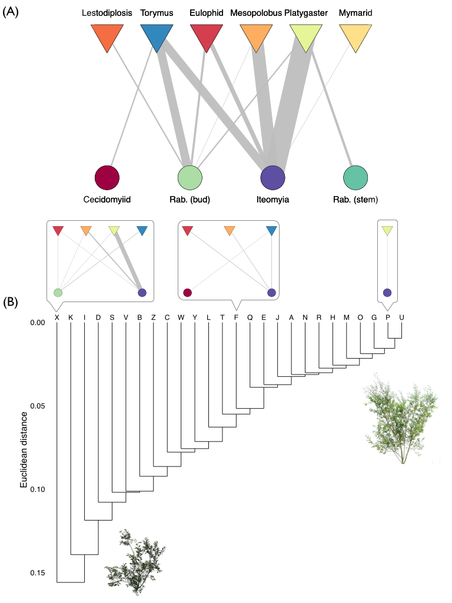

### Abstract. Re-read and revise later.
The structure of ecological networks is determined by interactions between individual organisms -- not species -- within a community. While we know this network structure can have a profound influence on community dynamics, we still have a limited understanding of how different genotypes and phenotypes of individual organisms contribute to overall network structure. We address this knowledge gap by using a common garden experiment to examine how genetic and phenotypic variation within a dominant plant species influences an insect herbivore-parasitoid interaction network. We found considerable beta-diversity in herbivore-parasitoid networks, which was primarily due to species turnover. In other words, herbivores were susceptible to different parasitoids depending on which plant genotype they were found on. In particular, we found that genetic variation in plant traits influenced both the density and size of herbivores, which in turn affected attack rates from parasitoids. Taken together, our results indicate that genetic variation can play a key role in structuring ecological networks. Furthermore, our results highlight the potential for microevolutionary processes to shape both the structure and dynamics of ecological networks.

### Introduction.  Re-read and revise later.
Network theory has emerged as a powerful framework for quantifying the arrangement of species interactions within communities and makes clear predictions for how this structure should influence community dynamics (Thebault2011, Stouffer2011, Rohr2014). However, studies quantifying the structure of ecological networks have been resolved predominantly to the species level (Ings et al., 2011); neglecting the considerable phenotypic variation that can exist within species and the fact that interactions occur between individuals -- not species -- within a community. By ignoring how individual differences scale up to affect species interactions, we risk overlooking fundamentally important aspects of ecological network structure.

Intraspecific genetic variation is a key driver of individual differences and there are a growing number of examples demonstrating its cascading effects on community assembly (Antonovics 1992; Whitham et al. 2003, 2012). For example, genetic variation within host-plant species can influence the abundance and diversity of herbivores and, in turn, alter interactions with higher trophic levels (Bailey et al., 2006; Johnson 2008; Abdala-Roberts and Mooney 2014). Similarly, genetic and phenotypic variation within predators has been found to mediate the strength of trophic cascades (Post et al. 2008; Harmon et al., 2009; Bassar et al., 2010). While it is clear that microevolutionary processes within a single species can influence community assembly, these studies have failed to examine the ecological interactions (i.e., genotype-species and species-species) that determine the assembly process. Consequently, we lack a detailed understanding of the structure of ecological interactions that shape the genetic basis to community assembly.

Incorporating genetic variation into network theory has the potential to reveal the underlying structures that mediate the ecological and evolutionary dynamics of communities. For instance, if certain species interact more frequently with particular genotypes as a result of their phenotype, then we hypothesize that this genetic specificity would result in a modular network structure. This modular structure may have two-fold consequences on the community. Ecologically, a modular structure has been shown to buffer the cascading effects of extinction on other species in antagonistic networks (Stouffer and Bascompte, 2011). Therefore, genetic variation may enhance the persistence of communities by creating a modular structure that is nested within a species. Evolutionarily, if we know the phenotypes associated with modules of genotype-species interactions, we can begin to predict how trait evolution will affect the eco-evolutionary dynamics of communities (Guimeras et al., 2011; Nuismer et al., 2012). Despite these promising avenues for future research, we currently lack empirical tests of genetic variation affecting the structure of ecological networks.

Here, we test the hypothesis that intraspecific genetic variation results in a modular network structure using the insect gall-parasitoid network (5 gall species, 8 parasitoid species) associated with the coastal willow Salix hookeriana. This willow-gall-parasitoid system was ideal for testing our hypothesis for two reasons. Firstly, *S. hookeriana* displays considerable genetic and phenotypic variation that results in variation in herbivory by galling insects (Barbour et al. 2015 in press). Second, the closed nature of galls restricts their parasitoid community to a small number of species that can successfully locate and parasitize galls. Consequently, it is easy to identify and quantify the sources of mortality, and ultimately, build quantitative interaction networks (van Veen et al. 2006). 

If genetic variation within species influences ecological network structure, we would predict the following two things. First, we predict that the willow-gall-parasitoid network would exhibit a modular structure, due to variation in the frequency of particular gall-parasitoid interactions among willow genotypes. Second, we predict that genetic variation in plant traits would be associated with variation in gall density and gall size, which in turn, would mediate the strength of gall-parasitoid interactions.  Taken together, our study seeks to understand how genetic variation shapes the structure of ecological networks. And since genetic variation provides the raw material for natural selection, establishing a genetic-basis to network structure will begin to inform the eco-evolutionary dynamics of ecological networks. 

### Methods

## Common Garden
To isolate the effects of genetic variation within Salix hookeriana (hereafter ‘willow’) on gall-parasitoid network structure, we used a common garden experiment consisting of 26 different genotypes of S. hookeriana (13 males; 13 females), located at Humboldt Bay National Wildlife Refuge (HBNWR) (40°40'53"N, 124°12'4"W) near Loleta, California, USA. Willow genotypes were collected from a single population of willows growing around Humboldt Bay. This common garden was planted in February 2009 with 25 clonal replicates (i.e., stem cuttings) of each willow genotype in a completely randomized design in two hectares of a former cattle pasture at HBNWR. Willows in our garden began flowering in February and reach their peak growth in early August. During this study, willows had reached 2-4 m in height. Further details on the genotyping and planting of the common garden are available in Barbour et al. (2014, in press).

## Beta-diversity of gall-parasitoid networks among willow genotypes
**HOW DATA WAS COLLECTED** To build quantitative gall-parasitoid networks, we collected galls from about 5 randomly chosen replicates of each genotype in September 2012 (N = 146 trees, range = 4-9 trees per genotype). For each replicate willow, we collected all galls occurring on one randomly selected basal branch. For each branch, we estimated the number of shoots based on an allometric equation using the stem diameter of the sampled basal branch (mean ± SD shoot count = 280 ± 124; details in supplementary materials). We then used these shoot estimates to quantify the density of galls and gall-parasitoid interactions on each replicate willow. To quantify gall-parasitoid interactions, we placed collected galls into 30 mL plastic transport vials (loosely capped at the end), which we maintained at room temperature in the lab for four months. We then opened galls under a dissecting scope and determined whether the gall survived or was parasitized, and if parasitized, the identity of the parasitoid species. We omitted from analyses those galls for which we could not reliably determine the cause of mortality.

**FRAMEWORK FOR MEASURING NETWORK BETA-DIVERSITY** We measured the beta-diversity of gall-parasitoid networks among willows by analyzing both qualitative and quantitaive differences in the composition of their links (i.e., species interactions) (Poisot et al. 2012). These differences in link composition can then be partitioned into species turnover and interaction components. Differences due to species turnover arise from the gain/loss of species (either gall or parasitoid) altering link composition, whereas differences due to interactions occur when species switch with whom they are interacting, despite having the same species composition. For qualitative differences, we transformed the quantitative network into presence/absence data and calculated the pairwise Euclidean distances between sites. We used Euclidean distance because this treats joint absences of interactions between sites as meaningful, THIS IS USUALLY JUSTIFIED WHEN LOOKING AT TURNOVER IN A RELATIVELY FOCUSED COMMUNITY, BUT WHEN YOU ARE LOOKING AT BETA-DIVERSITY ACROSS LARGER GRADIENTS IT MAY NOT BE USEFUL BECAUSE TWO SITES MAY NOT BE MORE SIMILAR BECAUSE THEY DON'T HAVE THE SAME SPECIES. WE ALSO USED THE JACCARD AND WHITTAKER INDEX WITH A SUBSET OF DATA, WHERE WE HAD ENOUGH REPLICATE GENOTYPES WITHOUT JOINT ABSENCES (N = 58 OR SOMETHING). THE RESULTS ARE QUALITATIVELY THE SAME AS THE EUCLIDEAN DISTANCE SO WE ONLY REPORT THEM IN THE SUPPLEMENTARY INFO.  Given that beta-diversity may also be influenced by differences in alpha-diversity between sites, we used the Raup-Crick null model to partition whether beta-diversity was due to simple changes in alpha-diversity among sites. We also looked at the euclidean distance of presence/absence networks. We even used subsets of the data where we had sufficients samples for each genotype. We therefore report these results in the supplementary info.
FOR QUANTITATIVE DIFFERENCES, WE ALSO USED EUCLIDEAN DISTANCE. AS WITH THE QUALITATIVE DATA, OTHER DISSIMILARITY INDICES GAVE QUALITATIVELY THE SAME RESULTS, WHICH WE REPORT IN THE SUPPLEMENTARY INFO. 

**ANALYZING NETWORK BETA-DIVERSITY** To test whether willow genetic variation drove beta-diversity of gall-parasitoid networks, we used permutational ANOVA (PERMANOVA, 'adonis' function with *vegan* package in R) on pairwise Euclidean distances between link composition, with willow genotype modelled as a random effect. We then partitioned the relative contribution of species turnover and interaction components (with betalink package in R) to understand the processes driving network beta-diversity among genotypes. To estimate the proportion of variance in network dissimilarity explained by willow genotype, we calculated broad-sense heritability (*H^2*) using the equation: H2 = VG / VP, where VG is the total genotypic variance among clones, and VP is the total phenotypic variance, calculated as the sum of the residual (Vr) and genetic variance (Lynch & Walsh 1998). Following Lynch and Walsh (1998), we estimated Vg and Vp from out PERMANOVA table. Broad-sense heritability values range between 0-1, where values close to zero indicate low heritability (i.e., gall resistance is strongly influenced by the environment), and values close to 1 indicate high heritability (i.e., gall resistance is strongly controlled by underlying genetic variation).

**PAIRWISE SPECIES-INTERACTIONS AMONG WILLOW GENOTYPES* FOR THE QUANTITATIVE DATA, WE WERE ALSO INTERESTED IN IDENTIFYING WHICH GALL-PARASITOID INTERACTIONS WERE DRIVING NETWORK BETA-DIVERSITY. TO DO THIS Given the quantitative nature of our data, we were interested in also identifying which gall-parasitoid interactions was driving network beta-diversity. To test whether the density of gall-parasitoid interactions varied among willow genotypes, we analyzed separate random effect models. Since we only had one response variable in each model, we used restricted maximum likelihood (REML) to estimate the variance due to willow genotype (VG) and unexplained residuals (Vr), which we used for calculating the broad-sense heritability of each interaction (METHODS PAPER). We then performed restricted likelihood-ratio tests to examine whether willow genotype explained a significant proportion of the variance in each gall-parasitoid interaction ('RLRTsim' function in *RLRTsim* package in R). 

To get at a more interpretable understanding of how species turnover could affect galling insects, we also divided up the natural enemy community into three different guilds. Egg parasitoids, larval parasitoids, and predators. These guilds may impose different functional constraints on galling insects. In particular, gall size. For example, for Cecidomyiid midges, larva initiate gall development, therefore we would not expect any characteristics of the gall to impose a functional constraint (e.g. gall size) on the likelihood of parasitoid attack, and is therefore causing selection on this stage of their life history. In contrast, larval parasitoids attack after the gall is formed and therefore, we would expect them to be influenced by the size of the gall and potentiall constrained from being able to oviposit in large galls. In our system, one of the species is a predatory midge which presumably attacks the larval stage as well, but giving their distant evolutionary relationship to parasitoid wasps, may be constrained by other factors, which is why we retained it as a separate guild. Therefore, we also analyzed differences in link composition when parasitoid species were collapsed into different guilds. 

## Genetic variation in plant traits influences gall density and size
To identify the plant traits mediating the resistance of willow genotypes to herbivory from galling insects, we first measured 40 different traits associated with variation in leaf quality (36 traits) and plant architecture (4 traits). Details on how these willow traits were sampled and quantified are given in Barbour et al. (2014, in press), but we summarize which traits were sampled here. Leaf quality traits included: phenolic chemistry (7 classes of compounds, 31 individual metabolites), trichome density, specific leaf area (SLA), water content, and percent Carbon and Nitrogen (converted to C:N). Plant architecture traits included: plant size, fractal dimension (index of architectural complexity), height, and foliage density. We calculated the broad-sense heritability (*H^2*) of plant traits using the equation: H2 = VG / VP, where VG is the total genotypic variance among clones, and VP is the total phenotypic variance, calculated as the sum of the residual and genetic variance (Lynch & Walsh 1998). Broad-sense heritability values range between 0-1, where values close to zero indicate low heritability (i.e., the trait is strongly influenced by the environment), and values close to 1 indicate high heritability (i.e., the trait is strongly controlled by underlying genetic variation). Each of these 40 traits exhibited significant broad-sense heritable variation among willow genotypes (mean leaf quality H2 = 0.72; mean architecture H2 = 0.27; range of H2 = 0.15 - 0.97; Barbour et al., 2014 in press). 

We calculated both gall density and gall size (measured as the maximum diameter perpendicular to direction of plant tissue growth, to the nearest 0.01 mm) of each species from our gall collections on each replicate willow tree (N = 146). 

To test whether willows exhibited genetic variation in resistance to galling insects, we analyzed separate random effect models for the density and size of each gall species. We used restricted maximum likelihood (REML) to estimate the variance due to willow genotype (VG) and unexplained residuals (Vr). We then performed restricted likelihood-ratio tests to examine whether willow genotype explained a significant portion of the variance in the density and size of each gall species ('RLRTsim' function in *RLRTsim* package in R). To estimate the proportion of variance in gall density and gall size explained by willow genotype, we calculated broad-sense heritability (*H^2*) using the equation: H2 = VG / VP, where VG is the total genotypic variance among clones, and VP is the total phenotypic variance, calculated as the sum of the residual (Vr) and genetic variance (Lynch & Walsh 1998). Broad-sense heritability values range between 0-1, where values close to zero indicate low heritability (i.e., gall resistance is strongly influenced by the environment), and values close to 1 indicate high heritability (i.e., gall resistance is strongly controlled by underlying genetic variation).

We only conducted our analysis though for gall species that were associated with genetic variation in gall-parasitoid interactions.
Gall density and gall size were transformed as needed to improve normality and reduce heteroscedasticity of model residuals.

As with each plant trait, we calculated the broad-sense heritability of gall density and gall size for each species. If we identified heritable variation in gall density or gall size among willow genotypes, we then used multiple regression with forward model selection to identify the key plant traits mediating resistance to galling insects. We mitigated multicollinearity using three different methods: principal components analysis, residual and sequential regression (Graham 2003), and omitting highly correlated traits (details in Barbour et al. 2014, in press). We used the forward model selection approach advocated by Blanchet et al. (2008), which prevents inclusion of spurious variables (i.e., inflated Type 1 error) and overestimation of explained variance (i.e., R2).

## Variation in gall density and size affects the strength of gall-parasitoid interactions
To test this prediction, we analyzed generalized linear and additive mixed-effect models (GLMM and GAMM, respectively). We modeled gall density, gall size and their interaction as fixed-effects, and included each replicate willow tree as a random effect. We modeled willow tree as a random effect because gall density was measured at the scale of the entire willow tree, but gall size was measured for individual galls collected from each willow tree. Since parasitoids often exhibit a non-linear response to variation in gall size (e.g., Hezewijk and Roland, 2003), we first analyzed GAMMs and only switched to simpler GLMMs if the difference in aikaike’s information criteria (AIC) values between the models was less than two (i.e., we chose the most parsimonious model). For GAMMs, we used the chi-squared statistic to test for non-linear effects of gall density, gall size, and their interaction. For GLMMs, we used parametric bootstrapping to test the effect of gall density, gall size, and their interaction. We always started with the most complex model and removed non-significant predictors (P > 0.05) until we identified the most parsimonious model. All GLMMs and GAMMs were analyzed in R using the lme4, gamm4, and pbkrtest packages (R core team 2013).

### Results

## Beta-diversity of gall-parasitoid networks among willow genotypes
In concordance with our prediction, we found that willow genotypes were associated with particular gall-parasitoid interactions, resulting in a modular food web structure (Q = 0.33, Z = 2.41, P = 0.008; Fig. 1). In particular, we detected five distinct modules. Three of these modules (Fig. 1; blue, purple, and red) were primarily determined by variation in the frequency of parasitism from three different parasitoid species on the most abundant gall former Iteomyia salicisverruca (63% of total observed gall-parasitoid interactions). Specifically, the frequency of parasitism from the egg, endoparasitoid Platygaster on Iteomyia varied 34.9-fold among willow genotypes (H2 = 0.31, RLRT = 21.61, P < 0.001), while parasitism from the larval, ectoparasitoids Mesopolobus (H2 = 0.11, RLRT = 3.77, P = 0.024) and Torymus (H2 = 0.25, RLRT = 14.75, P < 0.001) varied 10.5- and 5.7-fold among willow genotypes, respectively. Another gall former, R. salicisbrassicoides experienced a similar shift in its source of parasitism, although the strength of these interactions were weaker than the interactions with Iteomyia. In contrast, the three other gall species in our study system each participated in a single, but not necessarily distinct, compartment. The leaf galling sawfly Pontania had a distinct parasitoid community from the four gall midges. For the gall formers R. salicisbattatus and Cecidomyiid sp. A, we detected only a single associated parasitoid species each (Platygaster sp. and Torymus sp., respectively), but this may simply be a reflection of their relatively low abundances of these galls (5% and 4% of total galls, respectively).

##Genetic variation in plant traits influences gall density and size
We found that willows displayed heritable variation in resistance to galling insects in terms of both the density and size of galls. Specifically, the density for four of the five gall species varied between 22.8- and 70.2-fold among willow genotypes (Fig. 2A; range of H2 = 0.12 - 0.36), but was the most pronounced for the most common gall former, Iteomyia. Iteomyia was also the only gall species that varied in size (2.3-fold) among willow genotypes (Fig. 2B; H2 = 0.13, RLRT = 3.68, P = 0.022). 

We found that variation in both the density and size of galls was explained by both leaf quality and plant architecture traits. For example, the density of Iteomyia galls was higher on shorter willows with higher leaf C:N (R2 = 0.17, F2,119 = 12.14, P < 0.001); however, the size of Iteomyia galls was larger on willows with higher concentrations of salicylates and flavones in their leaves (R2 = 0.14, F2,75 = 5.88, P = 0.004). As with Iteomyia, the density of R. salicisbrassicoides galls was higher on shorter willows and higher leaf C:N (R2 = 0.15, F2,120 = 10.97, P < 0.001). The density of Pontania galls was higher on smaller willows with low leaf trichome density, but higher concentrations of flavones (R2 = 0.17, F3,106 = 7.38, P < 0.001). The density of Cecidomyiid sp. A galls was higher on willows with higher concentrations of flavanones and flavanonols (R2 = 0.10, F1,131 = 15.21, P < 0.001). 

##Variation in gall density and size affects the strength of gall-parasitoid interactions
We found that the dominant interactions in the gall-parasitoid network were shaped by an interaction between gall size and gall density. Specifically, the probability of Platygaster parasitizing Iteomyia decreased 18-fold over the range of gall sizes (Fig. 3A). For small-to-intermediate size galls though, the probability of Platygaster parasitizing Iteomyia increased 4.5-fold over the range of gall densities (Fig. 3C; 𝛘2 = 20.61, P < 0.001). In contrast to Platygaster, the probability of Mesopolobus parasitizing Iteomyia was highest for intermediate sized galls (Fig. 3B) and decreased 2.8-fold over the range of gall densities (Fig. 3D; 𝛘2 = 18.10, P = 0.003). The probability of Torymus parasitizing Iteomyia was not influenced by gall size, but similar to Mesopolobus, parasitism decreased 19-fold over the range of gall densities (Fig. 3E; 𝛘2 = 10.82, P = 0.001). 

## Network Dissimilarity

## Linking heritable plant traits to herbivore community/traits to network dissimilarity
Genotype and phenotype level. Need to consider removing a couple of the outlying trees...(at least for vLG and rG)

Mantel tests and path analysis?
First, do mantel tests for each one. Genotype and phenotype level.
Download package for looking at dissimilarity in size-structure of a community.

May be able to perform mantel tests with subset of plant traits that actually influence herbivores. And same thing with herbivores influencing network dissimilarity...

Consider including individual species responses in a supplement. I think these results are important for teasing apart the density-independent, -dependent, and size-dependent parasitoid responses.

### Figure Legends

